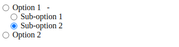

### **`Radio tree for VUE 3`**
 is a lightweight VueJS component library designed to create interactive, hierarchical radio button trees. Ideal for forms and user interfaces requiring a structured selection of options, `@shishir0019/radio-tree` allows developers to build nested radio button groups with ease. The package offers straightforward API methods for defining parent-child relationships among options, handling user selections, and integrating with existing form management systems.

**Features:**
- **Hierarchical Structure:** Easily create and manage nested radio button groups.
- **Customizable Appearance:** Style radio buttons and tree structures to match your application's design.
- **Event Handling:** Provides intuitive methods for capturing user interactions and changes.
- **Lightweight and Efficient:** Minimal footprint with optimized performance for large trees.

**Installation:**
```bash
npm i @shishir0019/radio-tree
```

**Usage:**
```typescript
<script setup lang="ts">
import { ref } from 'vue';

//@ts-ignore
import { RadioTree } from '@shishir0019/radio-tree'
import '@shishir0019/radio-tree/style.css'

const list = ref<any[]>([
  {
    label: 'Option 1',
    value: 'option1',
    children: [
      { label: 'Sub-option 1', value: 'suboption1' },
      { label: 'Sub-option 2', value: 'suboption2' }
    ]
  },
  {
    label: 'Option 2',
    value: 'option2'
  }
]);

const fromData = ref<any>({ selected: 'suboption2' })

</script>

<template>
  <RadioTree v-model="fromData.selected" :list="list"></RadioTree>
</template>
```
## Preview


**Documentation:**
## Interface
```typescript
IOptions {
  labelColored: boolean
}
```
## Props
```typescript
list: any[]
label?: string
name?: string
value?: string
children?: string
color?: string
disabled?: boolean
options?: IOptions
```

### Props Description

**`list:`** 
  - **Type:** `any[]`
  - **Description:** This is the main data source for the radio tree. It should be an array of objects where each object represents a node in the tree. Nodes can have a `label` to display the text, a `value` for the underlying data, and optionally `children` to create a nested structure. The `list` defines the entire hierarchy of radio buttons.

**`label:`** 
  - **Type:** `string`
  - **Description:** Specifies the key in each node object that holds the display label text for the radio buttons. The default is `'label'`. If your data uses a different key for labels, you can customize this prop.

**`name:`** 
  - **Type:** `string`
  - **Description:** Defines the name attribute for the radio buttons, which groups them together so only one option in the group can be selected at a time. This is important for form submissions and helps identify the radio buttons as part of a single group.

**`value:`** 
  - **Type:** `string`
  - **Description:** Specifies the key in each node object that holds the value of the radio button. This value is used to identify the selected option and can be used in form submissions. The default is `'value'`.

**`children:`** 
  - **Type:** `string`
  - **Description:** Determines the key in each node object that contains the child nodes. This is used to create nested or hierarchical radio button structures. By default, it’s set to `'children'`.

**`color:`** 
  - **Type:** `string`
  - **Description:** Allows you to set a color for the radio buttons or tree. This can be used to apply custom styling or theming to match your application’s design. The default is typically no color, allowing for default styles.

**`disabled:`** 
  - **Type:** `boolean`
  - **Description:** When set to `true`, disables all radio buttons in the tree, preventing user interaction. This is useful for scenarios where you need to render the tree but don’t want users to make any selections.

**`options:`** 
  - **Type:** `IOptions`
  - **Description:** An object that provides additional configuration for the radio tree. The `IOptions` interface might include settings like `labelColored`, which could determine whether the labels should be colored or styled differently. The default configuration typically includes settings like `label`, `value`, and `children` with their respective default values.

### Default Props

**`label:`** `'label'` 
  - The default key used to access the label text in each node.

**`value:`** `'value'` 
  - The default key used to access the value in each node.

**`children:`** `'children'` 
  - The default key used to access the child nodes in each node.

**`name:`** `'name'` 
  - The default name attribute for the radio buttons.
